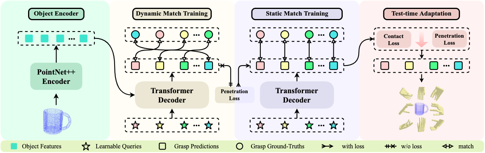

# <p align="center">Dexterous Grasp Transformer</p>

### <p align="center">*Guo-Hao Xu\*, Yi-Lin Wei\*, Dian Zheng, Xiao-Ming Wu, Wei-Shi Zheng*</p>

#### <p align="center">[[Paper]](https://arxiv.org/abs/2404.18135) &nbsp;&nbsp;&nbsp; [[Project]](https://isee-laboratory.github.io/dgtr/) </p>


### (CVPR 2024) Official repository of paper "Dexterous Grasp Transformer".


# Installation
1. Create a new conda environment
```shell
conda create -n dgtr python=3.8
```
2. Install pytorch
```shell
conda install pytorch==1.10.0 torchvision==0.11.0 cudatoolkit=11.3 -c pytorch -c conda-forge
```
3. Install pytorch3d
- Download source code of pytorch3d 0.7.2 from [link](https://github.com/facebookresearch/pytorch3d/releases/tag/v0.7.2) and unzip it. 
```
cd pytorch3d && pip install -e .
```
4. Install other dependencies
```shell
conda install -c plotly 
conda install -c conda-forge trimesh pyyaml tqdm plyfile multimethod
conda install scipy
conda install -c anaconda lxml
conda install tensorboard
```

5. Install pytorch_kinematics
```shell
cd thirdparty/pytorch_kinematics
pip install -e .
```

6. Install CSDF
```shell
cd thirdparty/CSDF
pip install -e .
```

7. Install pointnet2
```shell
cd thirdparty/pointnet2
python setup.py install
```

8. Install knn
```shell
cd thirdparty/knn
python setup.py install
```

9. Install rtree
```shell
pip install rtree
```

10. If you have encountered setuptools-related error, this may help:
```shell
pip install setuptools==59.5.0
```
## Data Preparation
1. We pre-sample the object point clouds from [DexGraspNet](https://github.com/PKU-EPIC/DexGraspNet) and save them as h5 files to accelerate data processing. The training and testing h5 files can be downloaded from [Google Drive](https://drive.google.com/drive/folders/1RNtPrmE5TmfBmFzbtWYz261mEd7LZ0xT?usp=drive_link). Alternatively, you can load the object .obj files directly and sample the point clouds yourself.

2. The directory should be as follows:
```
.data/             
├── mjcf/         
├── dexgrasp_train.h5   
└── dexgrasp_test.h5   
```


# Usage
## Train
1. Train DGTR in Dynamic Match Training phase for 15 epochs.
```
CUDA_VISIBLE_DEVICES="0" python train.py --train_cfg config/dgtr.yaml
```
2. Train DGTR in Static Match Warm-up Training phase for 5 epochs.
```
CUDA_VISIBLE_DEVICES="0" python train.py \
--train_cfg config/dgtr.yaml \
-r \
-c <checkpoint of epoch 15> \
--override assignments \"static\" data.train.assignment \"./Experiments/dgtr/assignment_epoch_15.json\"
```
3. Train DGTR in Static Matching Penetration Training phase for 5 epochs.
```
CUDA_VISIBLE_DEVICES="0" python train.py \
--train_cfg config/dgtr_pen.yaml \
-r \
-c <checkpoint of epoch 20> \
--override assignments \"static\" data.train.assignment \"./Experiments/dgtr/assignment_epoch_15.json\"
```

## Inference
```
python ./test.py \
--train_cfg config/dgtr.yaml \
--test_cfg ./config/test_default.yaml \
--override model.checkpoint_path \"<checkpoint of epoch 25>\"
```

## Evaluation
```
python ./tools/evaluate.py -r <the path of raw_results.json> --gpus <GPU_ID>
```

## Visualization
```
python ./vis/visualize_results.py -r <the path of matched_results.json> -s -o <num>
```


## Acknowledgements

The code of this repository is based on the following repositories. We would like to thank the authors for sharing their works.

- [DexGraspNet](https://github.com/PKU-EPIC/DexGraspNet)

- [UniDexGrasp](https://github.com/PKU-EPIC/UniDexGrasp)


## Contact
- Email: {xugh23, weiylin5}@mail2.sysu.edu.cn 

## Citation
Please cite it if you find this work useful.
```
@inproceedings{xu2024dexterous,
 title = {Dexterous Grasp Transformer},
 author = {Xu, Guo-Hao and Wei, Yi-Lin and Zheng, Dian and Wu, Xiao-Ming and Zheng, Wei-Shi},
 booktitle = {Proceedings of the IEEE/CVF Conference on Computer Vision and Pattern Recognition},
 year = {2024}
 }
```


CUDA_VISIBLE_DEVICES="4" python train.py \
--train_cfg config/dgtr.yaml \
-r \
-c Experiments/test/epoch15_minus_loss_-21.8473_.pth \
--override assignments \"static\" data.train.assignment \"Experiments/test/assignment_epoch_15.json\"